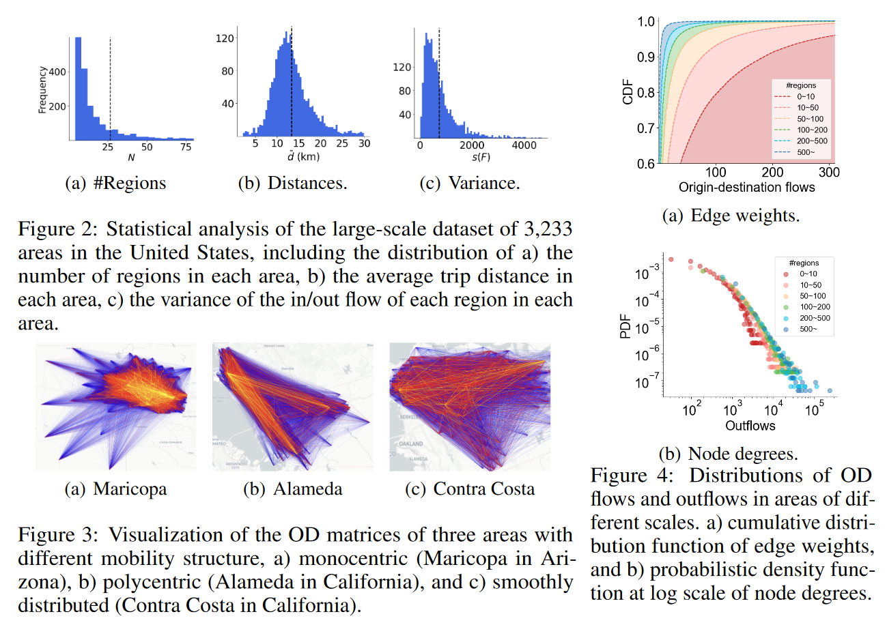

# A Large-scale Dataset for Commuting OD Matrix Generation

This is the official repository of the submission of NeurIPS 2024 D&B Track paper *A Large-scale Benchmark Dataset for Commuting Origin-destination Matrix Generation*. This dataset consists of a total count of 3,233 areas around the United States, using counties as area boundaries and census tracts as region units in the corresponding area, each area including its regional spatial characteristics and commuting OD matrix.



## 1. Data Description

### Regional Spatial Characteristics

Each region is characterized by demographics and urban functionalities, derived from American Community Survey (ACS) by the U.S. Census Bureau and the distribution of POIs from OpenStreetMap. Demographics include the population structure of a region based on age, gender, income, education, and other factors, encompassing a total of 97 dimensions. POIs are divided into 36 different categories. The distances between regions are calculated using the planar Euclidean distance between their centroids.

| Characteristics of Demographic Part |  
|   :---    |     
| Total Population                                        |
| Male Population                                         |
| Female Population                                       |
| Under 5 Years - Total                                   |
| Under 5 Years - Male                                    |
| Under 5 Years - Female                                  |
| 5 to 9 Years - Total                                    |
| 5 to 9 Years - Male                                     |
| 5 to 9 Years - Female                                   |
| 10 to 14 Years - Total                                  |
| 10 to 14 Years - Male                                   |
| 10 to 14 Years - Female                                 |
| 15 to 19 Years - Total                                  |
| 15 to 19 Years - Male                                   |
| 15 to 19 Years - Female                                 |
| 20 to 24 Years - Total                                  |
| 20 to 24 Years - Male                                   |
| 20 to 24 Years - Female                                 |
| 25 to 29 Years - Total                                  |
| 25 to 29 Years - Male                                   |
| 25 to 29 Years - Female                                 |
| 30 to 34 Years - Total                                  |
| 30 to 34 Years - Male                                   |
| 30 to 34 Years - Female                                 |
| 35 to 39 Years - Total                                  |
| 35 to 39 Years - Male                                   |
| 35 to 39 Years - Female                                 |
| 40 to 44 Years - Total                                  |
| 40 to 44 Years - Male                                   |
| 40 to 44 Years - Female                                 |
| 45 to 49 Years - Total                                  |
| 45 to 49 Years - Male                                   |
| 45 to 49 Years - Female                                 |
| 50 to 54 Years - Total                                  |
| 50 to 54 Years - Male                                   |
| 50 to 54 Years - Female                                 |
| 55 to 59 Years - Total                                  |
| 55 to 59 Years - Male                                   |
| 55 to 59 Years - Female                                 |
| 60 to 64 Years - Total                                  |
| 60 to 64 Years - Male                                   |
| 60 to 64 Years - Female                                 |
| 65 to 69 Years - Total                                  |
| 65 to 69 Years - Male                                   |
| 65 to 69 Years - Female                                 |
| 70 to 74 Years - Total                                  |
| 70 to 74 Years - Male                                   |
| 70 to 74 Years - Female                                 |
| 75 to 79 Years - Total                                  |
| 75 to 79 Years - Male                                   |
| 75 to 79 Years - Female                                 |
| 80 to 84 Years - Total                                  |
| 80 to 84 Years - Male                                   |
| 80 to 84 Years - Female                                 |
| 85 Years and Over - Total                               |
| 85 Years and Over - Male                                |
| 85 Years and Over - Female                              |
| Median Age - Total                                      |
| Median Age - Male                                       |
| Median Age - Female                                     |
| Median Earnings (Dollars)                               |
| Class of Worker - Private Wage and Salary Workers       |
| Class of Worker - Government Workers                    |
| Class of Worker - Self-Employed Workers                 |
| Class of Worker - Unpaid Family Workers                 |
| Travel Time to Work - Mean Travel Time (Minutes)        |
| Vehicles Available - No Vehicle Available               |
| Vehicles Available - 1 Vehicle Available                |
| Vehicles Available - 2 Vehicles Available               |
| Vehicles Available - 3 or More Vehicles Available       |
| Total Households                                        |
| Average Household Size                                  |
| Total Families                                          |
| Average Family Size                                     |
| Nursery School, Preschool                               |
| Kindergarten to 12th Grade                              |
| Kindergarten                                            |
| Elementary: Grade 1 to Grade 4                          |
| Elementary: Grade 5 to Grade 8                          |
| High School: Grade 9 to Grade 12                        |
| College, Undergraduate                                  |
| Graduate, Professional School                           |
| 9th to 12th Grade, No Diploma                           |
| Associate's Degree                                      |
| Bachelor's Degree                                       |
| Bachelor's Degree or Higher                             |
| Graduate or Professional Degree                         |
| High School Graduate (Includes Equivalency)             |
| High School Graduate or Higher                          |
| Less Than 9th Grade                                     |
| Less Than High School Graduate                          |
| Population 25 to 34 Years - Bachelor's Degree or Higher |
| Population 25 to 34 Years - High School Graduate or Higher |
| Some College or Associate's Degree                      |
| Some College, No Degree                                 |
| Poverty - Male                                          |
| Poverty - Female                                        |


| Characteristics of Point-of-interests Part |  
|   :---    |     
| finance          |
| public           |
| transport        |
| entertainment    |
| health           |
| service          |
| education        |
| government       |
| religion         |
| accommodation    |
| food             |
| cafe             |
| fast_food        |
| ice_cream        |
| pub              |
| restaurant       |
| shop_beauty      |
| shop_clothes     |
| boutique         |
| shop_transport   |
| retail           |
| commodity        |
| marketplace      |
| home-improvement |
| sport            |
| public_transport |
| kindergarten     |
| office           |
| recycling        |
| travel_agency    |
| tourism          |
| shop_livelihood  |
| residential      |
| dormitory        |

### Commuting OD Matrices

We construct the OD matrices for all areas using data on commuting patterns from the 2018 Longitudinal Employer-Household Dynamics Origin-Destination Employment Statistics (LODES) dataset. These matrices represent aggregated commuting flows within areas. Each entry in an OD matrix denotes the count of individuals residing in one region and working in another, effectively mapping the commuting patterns of workers across different regions. The LODES dataset is widely used in existing works. In this dataset, the commuting information is aggregated by the cooperation and other kind of work units, which is more reliable and accurate than the individual commuting data. Therefore, in the data collection process, information has been ensured to be representative at a national scale, thus eliminating sampling errors.

## 2. Benchmark Experiments

### Prerequisites

To conduct the benchmark experiments, users should first prepare a Python environment containing the necessary libraries. 

To conduct the experiments, ensure you have the following setup:

- **Python Version:** Python 3.8

- **Required Libraries:**
  - `numpy`
  - `scikit-learn==1.3.0`
  - `torch==2.1.0+cu118`
  - `scipy==1.10.1`
  - `dgl==1.1.2+cu117`
  - `networkx==3.1`
  
Please install or update these libraries to match the specified versions for optimal compatibility.

### Run Experiments

The code for the benchmark experiments is stored in the `./model/*` directory. Each model-specific folder contains a `main.py` file, which serves as the entry point for executing the benchmark experiment. To run a specific benchmark experiment, simply execute the `main.py` file directly.

To run the model, follow these specific steps:
1. **Navigate to the Project Root Directory:**
   
   Use the `cd` command to change into the project's root directory.
   ```bash
   cd path_to_this_proj
   ```
2. **Execute the Model Script:**
   
   Run the `main.py` file located in the WeDAN model directory `./WeDAN` by using the following command:
   ```bash
   python WeDAN/main.py
   ```
**The experimental results are shown as follows.**

| Model    | CPC   | RMSE  | NRMSE | inflow | outflow | ODflow |
|----------|-------|-------|-------|--------|---------|--------|
| GM-P     | 0.321 | 174.0 | 2.222 | 0.668  | 0.656   | 0.409  |
| GM-E     | 0.329 | 162.9 | 2.080 | 0.652  | 0.637   | 0.422  |
| SVR      | 0.420 | 95.4  | 1.218 | 0.417  | 0.555   | 0.410  |
| RF       | 0.458 | 100.4 | 1.282 | 0.424  | 0.503   | 0.219  |
| GBRT     | 0.461 | 91.0  | 1.620 | 0.424  | 0.491   | 0.233  |
| DGM      | 0.431 | 92.9  | 1.186 | 0.469  | 0.561   | 0.230  |
| GMEL     | 0.440 | 94.3  | 1.204 | 0.445  | 0.355   | 0.207  |
| NetGAN   | 0.487 | 89.1  | 1.138 | 0.429  | 0.354   | 0.191  |
| DiffODGen| 0.532 | 74.6  | 0.953 | 0.324  | 0.270   | 0.149  |
| WeDAN    | 0.593 | 68.6  | 0.876 | 0.291  | 0.269   | 0.147  |


### Extra Usage of This Dataset

To validate your model using this dataset, you can utilize existing scripts for data loading and performance evaluation. Follow these steps to set up and execute your experiments:

1. **Create a Directory for Your Model**:
   
   Prepare a folder to house your model experiments:
   ```bash
   mkdir ./name_of_your_model
   ```
2. **Write Your Model and Entry Script:**
    - Develop your own `model.py` to describe your model.
    - Create a `main.py` to serve as the entry point of your experiment. This script should reuse the existing `data_load.py` and `metrics.py`:
3. **Execute Your Model:**
   
   Navigate to the project root directory and run your model:
   ```bash
   cd path_to_this_proj
   python ./name_of_your_model/main.py
   ```